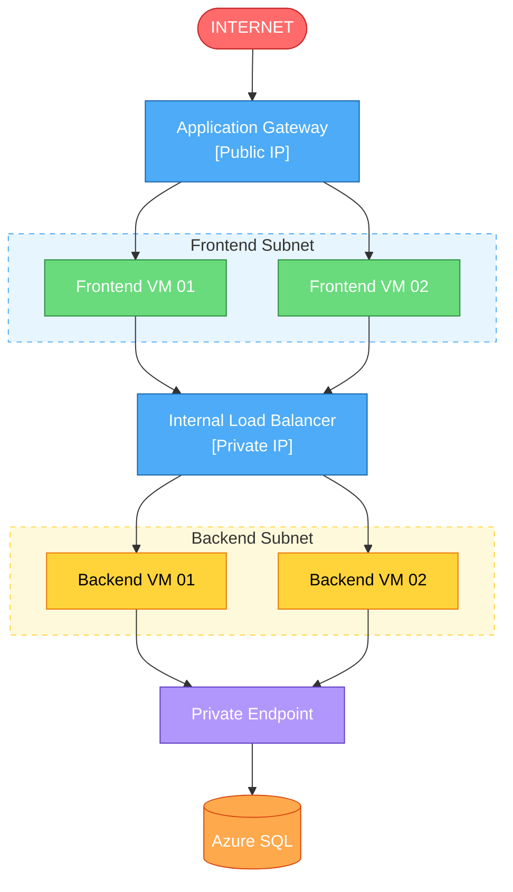
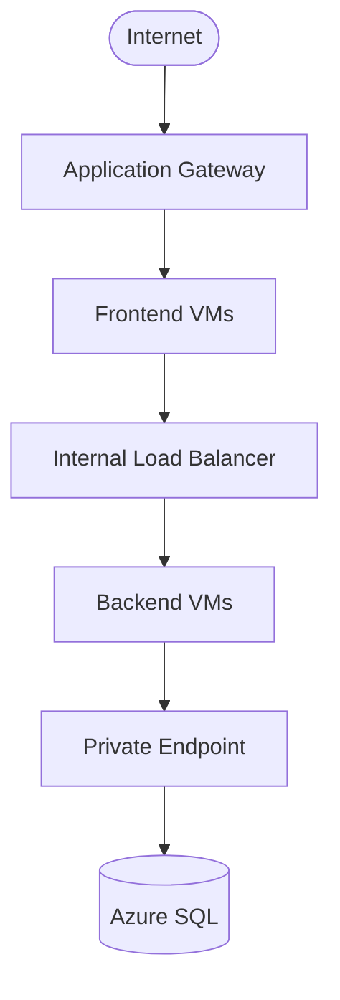
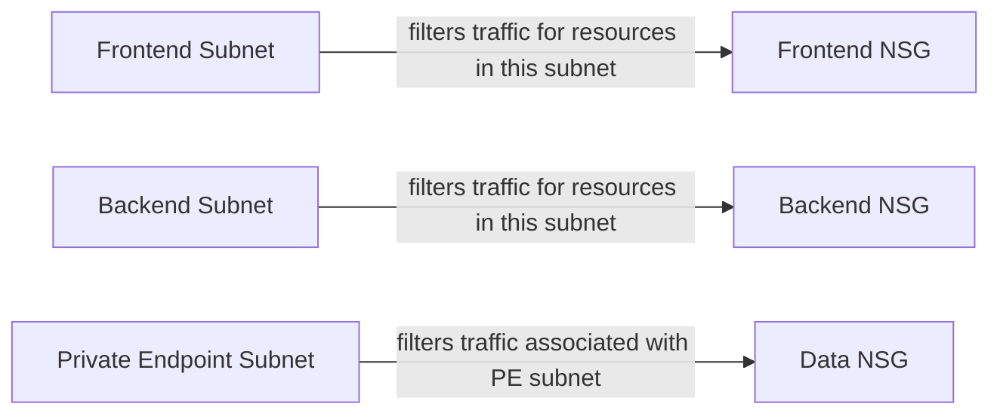
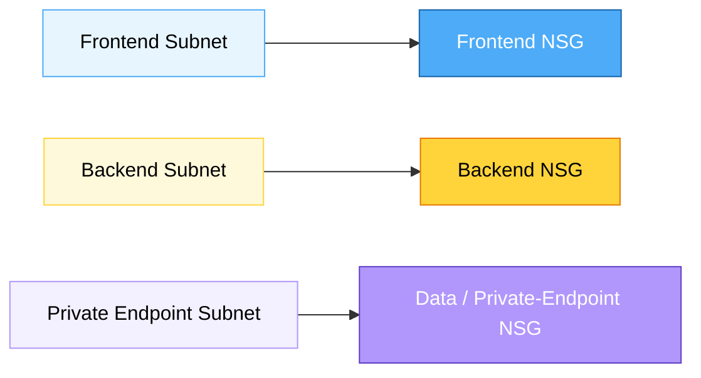
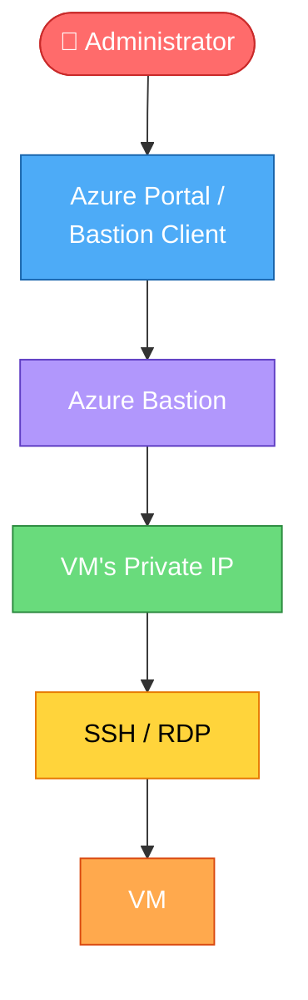

# Crocus Terraform Azure Infrastructure

Crocus is a Terraform-based Azure infrastructure repository built for a secure hub-and-spoke architecture in the `japaneast` region. The project is organized around reusable child modules and environment-specific inputs so deployment logic can be reused across `dev`, `stage`, and `prod` without duplicating infrastructure code.

## Purpose

This repository is designed to provision a repeatable Azure landing zone and application platform. It supports:

- hub-and-spoke network segregation
- public ingress through an Application Gateway
- secure administrative access through Bastion
- frontend and backend workload tiers
- internal traffic distribution with a load balancer
- centralized monitoring with Log Analytics and Application Insights
- modular Terraform structure for reuse and maintenance

## Architecture overview

The design follows a hub-and-spoke pattern with a private application tier and a public entry point.

### Traffic path

# Architecture



This is the actual request path. The App Gateway and the Internal Load Balancer are the traffic path components. The private endpoint is the private access point to Azure SQL, not a network hop in the same sense as a load balancer.

All application VMs use private IP addresses only. There is no public IP assigned to the frontend VMs, backend VMs, database tier, or the internal load balancer.

### Hub layer
- Azure Bastion for secure administrative access
- shared connectivity services
- optional Azure Firewall, VPN, or ExpressRoute components for future enterprise connectivity

### Spoke layer
- Application Gateway in the application/spoke VNet
- frontend subnet
- backend subnet
- database/private access subnet
- internal Load Balancer
- application workloads and private services

This separation keeps the hub focused on shared connectivity and administration, while the spoke carries the application runtime and data path.

### Internal Load Balancer

The Internal Load Balancer (ILB) is private-only and is used to distribute traffic between backend VMs. It has a private frontend IP and is not internet-facing. Frontend VMs communicate with the ILB over private networking, which keeps application traffic off the public internet.

### Security model

NSGs are security policy attachments, not traffic hops.



### SECURITY / NSG ASSOCIATION




This means:
- App Gateway / ILB = path
- NSG = security rule boundary
- Private Endpoint = private connectivity to Azure SQL

### Private administration flow

`### Administrator Access via Azure Bastion



This is the reason Bastion is deployed in the hub: it provides a secure, controlled admin entry path to private workloads without exposing the workload tier directly to the internet.

## Environment structure

The repository separates deployment logic by environment:

```text
env/
├── dev/
├── stage/
└── prod/
```

The same reusable child modules are consumed by each environment with environment-specific inputs. This keeps the landing zone consistent while allowing each environment to vary in naming, sizing, and policy requirements.

## Root structure

```text
.
├── README.md
├── LICENSE
├── backend.tf
├── env/
│   ├── dev/
│   ├── stage/
│   └── prod/
├── modules/
│   ├── app/
│   ├── bastion/
│   ├── gateway/
│   ├── lb/
│   ├── monitoring/
│   ├── network/
│   ├── nic/
│   ├── nsg/
│   ├── nsg-association/
│   ├── private-access/
│   ├── public-ip/
│   ├── rg/
│   ├── sa/
│   ├── security/
│   └── vm/
├── credential_example/
├── .azuredevops/
├── .github/
└── docs/


```

## Key Terraform modules

The project is built with reusable child modules including:

- `modules/network` – VNets, subnets, and VNet peering
- `modules/nsg` – security group definitions
- `modules/nsg-association` – subnet-to-NSG mapping
- `modules/nic` – NIC creation for VMs
- `modules/vm` – Linux VM deployment
- `modules/lb` – internal load balancing
- `modules/gateway` – Application Gateway
- `modules/bastion` – Azure Bastion
- `modules/public-ip` – public IP allocation
- `modules/monitoring` – Log Analytics, Application Insights, and Azure Monitor integration
- `modules/sa` – storage account provisioning
- `modules/rg` – resource group provisioning
- `modules/security` – security-focused configuration and policy-aligned controls -key-vault
- `modules/private-access` – private DNS and private endpoint patterns

The parent environment configuration in `env/dev/main.tf` wires these modules together.

## Current resource design

The active Terraform state includes:

- resource groups
- storage account
- hub and spoke VNets
- dedicated subnets for application routing and workload separation
- VNet peering
- NSGs and subnet associations
- NICs
- 4 Linux VMs (`Standard_F1als_v7`) configured as:
  - 2 frontend VMs
  - 2 backend VMs
- a managed SQL database/data service in the application/data path
- 2 public IPs
- 1 Application Gateway
- 1 Bastion host
- 1 internal load balancer
- Log Analytics Workspace, Application Insights, and Azure Monitor-related telemetry resources

There is no separate database VM in the current Terraform state, so the database/data tier is represented by the SQL resource layer rather than a dedicated database VM.

## NSG flow

The network security pattern is explicit, but NSGs are not traffic hops.

```text
Internet
   ↓
Application Gateway
   ↓
Frontend VMs
   ↓
Internal Load Balancer
   ↓
Backend VMs
   ↓
Private Endpoint
   ↓
Azure SQL
```

In parallel, the subnet security policy is applied as:

```text
Frontend Subnet → Frontend NSG
Backend Subnet → Backend NSG
Private Endpoint Subnet → Data NSG
```

This enforces least-privilege segmentation. Direct Internet-to-backend or Internet-to-database access is not intended.

## Public IP usage

The current design contains exactly two public IPs:

- 1 Public IP → Application Gateway
- 1 Public IP → Azure Bastion

The following are intentionally not public:

- No public IP on frontend VMs
- No public IP on backend VMs
- No public IP on database VM
- No public IP on the internal Load Balancer

## Key Vault and secret handling

A Key Vault pattern is part of the intended security design for the platform. Application and database secrets should not be stored directly in Terraform `.tfvars` files. Secrets should be managed through Azure Key Vault and referenced via secure configuration patterns, RBAC, and managed identities where applicable.

The repository contains the `modules/security` and `modules/private-access` patterns, and the dedicated `modules/key-vault` module is now part of the secure architecture for this landing zone.

## Monitoring and observability

The monitoring design includes:

- Log Analytics Workspace
- Application Insights
- Azure Monitor
- Metric alerts
- Log alerts
- Action Groups

This allows centralized diagnostics, application telemetry, alerting, and operational visibility across the landing zone.

## VNet peering

The hub and spoke VNets are peered through the `modules/network` module. The module loops through all VNets and creates a peering relationship for each pair, enabling communication between shared hub services and spoke workloads while keeping the boundary clear and reusable.

## Backend configuration

Terraform remote state is configured in `backend.tf`. It uses Azure Storage as the backend and requires real storage values before an actual environment deployment.

## Production considerations

For a production-ready deployment, the following should be considered and implemented where supported:

- private-only VM networking
- Key Vault integration and secret management
- Azure Monitor, alerts, and Action Groups
- backup and disaster recovery strategy
- zone redundancy / multi-AZ deployment for supported resources
- RBAC and least-privilege access
- managed identities
- Azure Policy enforcement
- Defender for Cloud protections
- private endpoints where applicable

These are production hardening patterns and should be evaluated against the final Azure landing zone design, not assumed as fully implemented in every module unless explicitly configured in code.

## Typical workflow

```bash
cd env/dev
terraform init
terraform validate
terraform plan
terraform apply
```

## Deployment notes

- The project targets Azure resources in `japaneast`
- The code is modular and environment-aware
- Some services are intentionally left as placeholders or commented modules until the real Azure environment is configured
- Real Azure backend values, subscription context, and credentials must be filled in before a live deployment

## Summary

Crocus is a modular Azure Terraform project for creating a secure hub-and-spoke infrastructure with a public ingress point, private application tiers, internal traffic distribution, monitoring, and reusable environment-driven deployment logic. The intended pattern is a three-tier application design in which the hub hosts shared admin and connectivity services, while the spoke contains the Application Gateway, frontend tier, backend tier, and data services behind private networking.

## Typical workflow

```bash
cd env/dev
terraform init
terraform validate
terraform plan
terraform apply
```

## Deployment notes

- The project targets Azure resources in `japaneast`
- The code is modular and environment-aware
- Some services are intentionally left as placeholders or commented modules until the real Azure environment is configured
- Real Azure backend values, subscription context, and credentials must be filled in before a live deployment

## Summary

Crocus is a modular Azure Terraform project for creating a secure hub-and-spoke infrastructure with ingress, frontend/backend workload tiers, internal distribution, monitoring, and reusable environment-driven deployment logic. It is structured to grow into a more complete enterprise platform while keeping the infrastructure code organized and reusable.

